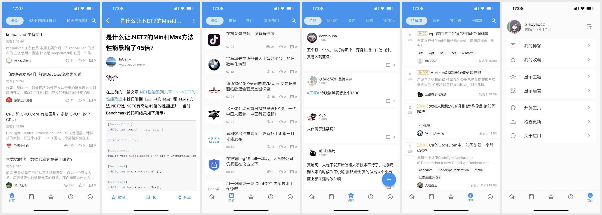

# 博客园元服务

## 参考界面

## TODO

1. [x] 首页列表下拉刷新与上拉加载更多
2. [x] 文章详情
3. [ ] 文章评论加载
4. [ ] 登录集成
5. [x] 客户端访问令牌集成

## 其它开源项目

1. [使用Flutter编写的博客园客户端，支持iOS及Android](https://github.com/xiaoyaocz/flutter_cnblogs.git)
2. [博客园第三方Android客户端](https://github.com/raedev/android-cnblogs)